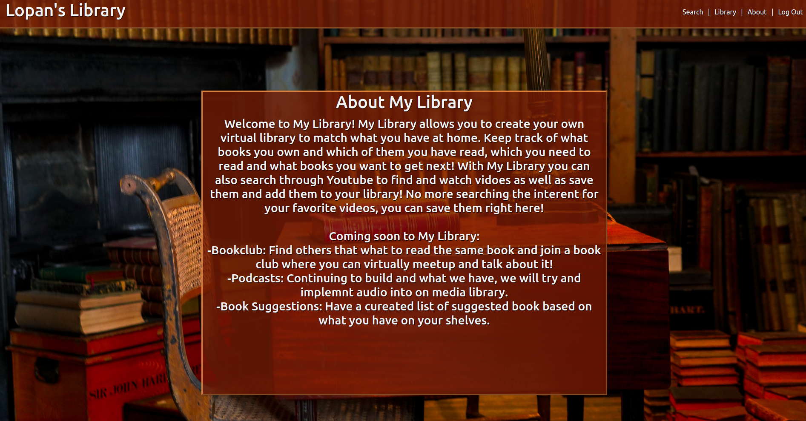
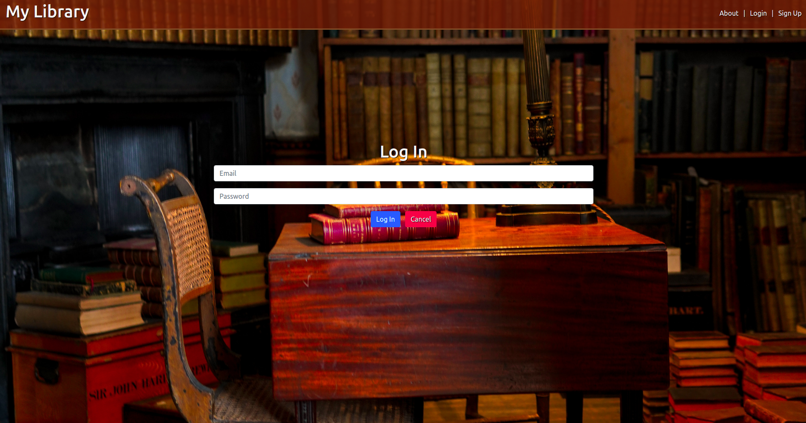
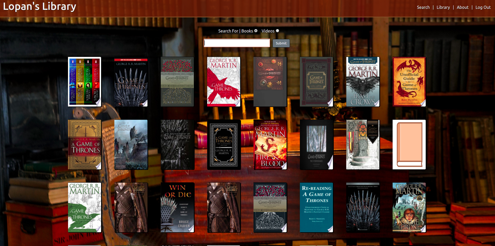
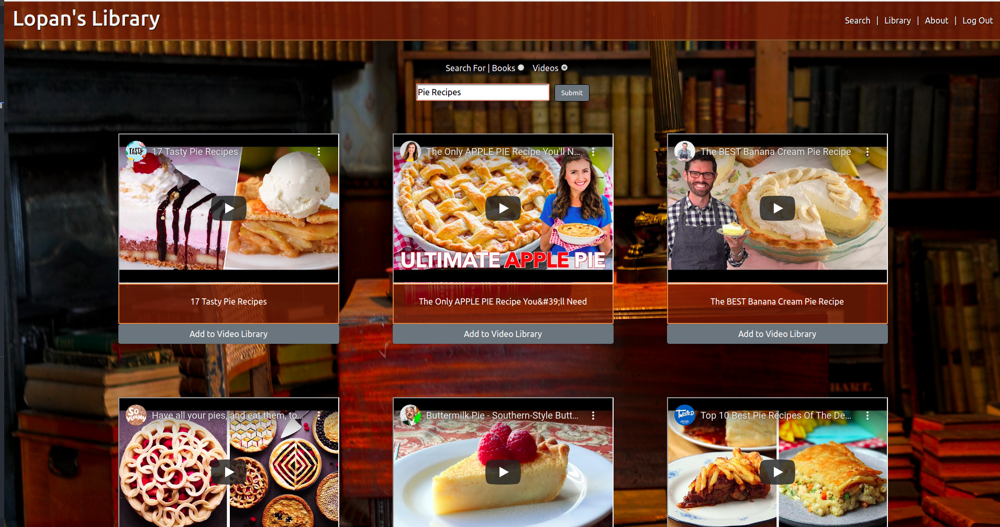
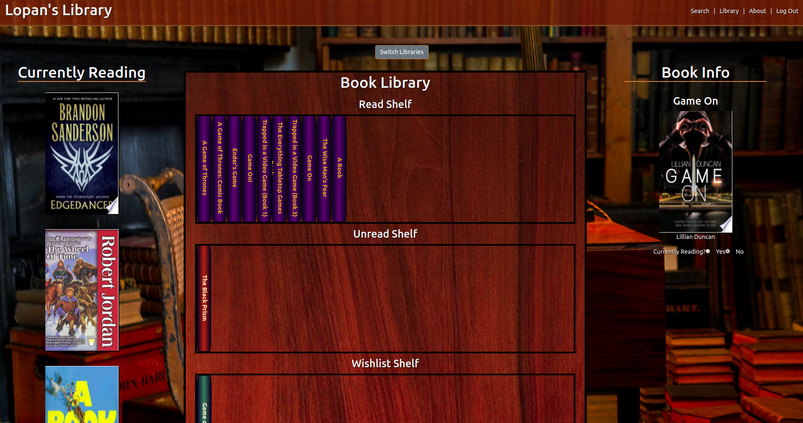
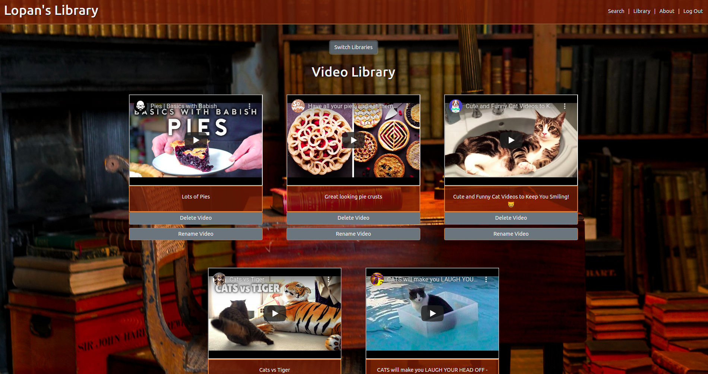
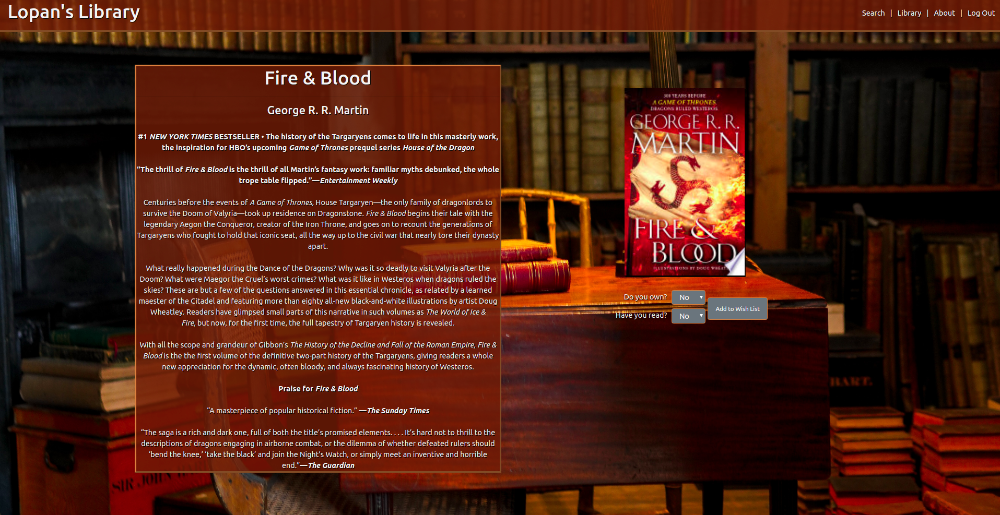

# My Library

My Library is an app developed to help keep track of the books on your shelf! It will keep a comprehensive list, that you can sort by what you have read and what you need to read still. You will be able to search for your books and add them to your library and designate where on the shelf they need to go. Create a wish list for the books you would like to own/read next! View what others are reading to see if they have anything that peeks your interest and add it to your list! Recently added addition: you can now search through youtube content and create a video library along with you book library, we've gone mutlimedia! 
Coming soon to My Library: 
-Bookclub: Find others that what to read the same book and join a book club where you can virtually meetup and talk about it! 
-Podcasts: Continuing to build and what we have, we will try and implement audio into on media library. 
-Book Suggestions: Have a cureated list of suggested book based on what you have on your shelves. 

Trello Board Link 
https://trello.com/b/ROb5V7j8/my-library
(Trello conatins Wire-Frames and ERD)

Deployed Heroku Link 
https://rf-my-library.herokuapp.com/books

This Project was made using:
 
-React 
-Node.js 
-Express 
-MondoDB 
-CSS 
-Google Books API 
-Bootstrap 

AboutPage

Login Page

Book Search

Video Search Page

Book Library Page

Video Libary Page

Book Info Page

Icebox/Future Steps

-Peer to peer communication via sockets for a bookclub  
-Continue to build on sorting of book shelves and for video library 
-Ability to re-name vidoes and add categories to create folders for content 
-More refined search methods for both video and books 
-Ability to look at other libraries 
-Suggestions based on what you have read 
